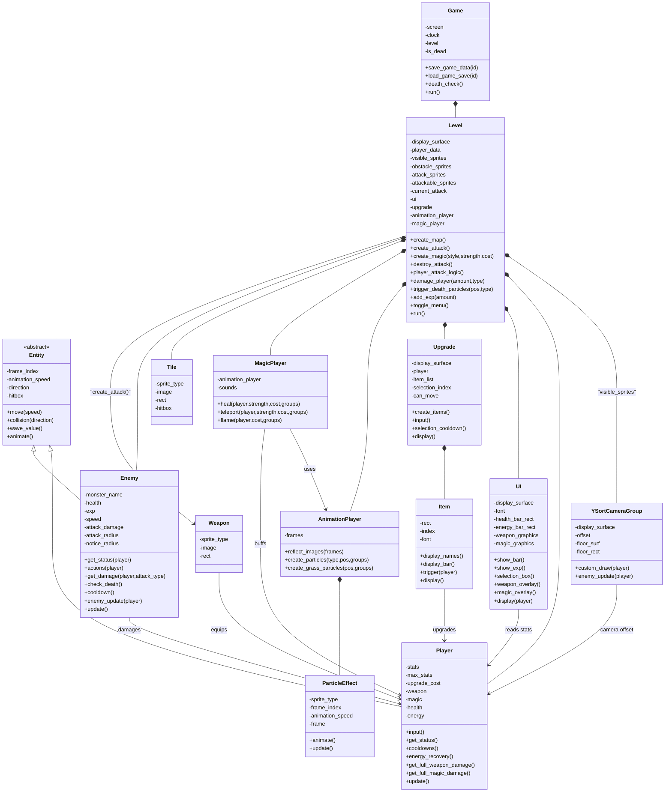

# Game Architecture Class Diagram

```mermaid
classDiagram
    class Game {
        -screen
        -clock
        -level
        -is_dead
        +save_game_data(id)
        +load_game_save(id)
        +death_check()
        +run()
    }

    class Level {
        -display_surface
        -player_data
        -visible_sprites
        -obstacle_sprites
        -attack_sprites
        -attackable_sprites
        -current_attack
        -ui
        -upgrade
        -animation_player
        -magic_player
        +create_map()
        +create_attack()
        +create_magic(style,strength,cost)
        +destroy_attack()
        +player_attack_logic()
        +damage_player(amount,type)
        +trigger_death_particles(pos,type)
        +add_exp(amount)
        +toggle_menu()
        +run()
    }

    class YSortCameraGroup {
        -display_surface
        -offset
        -floor_surf
        -floor_rect
        +custom_draw(player)
        +enemy_update(player)
    }

    class Entity {
        <<abstract>>
        -frame_index
        -animation_speed
        -direction
        -hitbox
        +move(speed)
        +collision(direction)
        +wave_value()
        +animate()
    }

    class Player {
        -stats
        -max_stats
        -upgrade_cost
        -weapon
        -magic
        -health
        -energy
        +input()
        +get_status()
        +cooldowns()
        +energy_recovery()
        +get_full_weapon_damage()
        +get_full_magic_damage()
        +update()
    }

    class Enemy {
        -monster_name
        -health
        -exp
        -speed
        -attack_damage
        -attack_radius
        -notice_radius
        +get_status(player)
        +actions(player)
        +get_damage(player,attack_type)
        +check_death()
        +cooldown()
        +enemy_update(player)
        +update()
    }

    class Tile {
        -sprite_type
        -image
        -rect
        -hitbox
    }

    class Weapon {
        -sprite_type
        -image
        -rect
    }

    class MagicPlayer {
        -animation_player
        -sounds
        +heal(player,strength,cost,groups)
        +teleport(player,strength,cost,groups)
        +flame(player,cost,groups)
    }

    class AnimationPlayer {
        -frames
        +reflect_images(frames)
        +create_particles(type,pos,groups)
        +create_grass_particles(pos,groups)
    }

    class ParticleEffect {
        -sprite_type
        -frame_index
        -animation_speed
        -frame
        +animate()
        +update()
    }

    class UI {
        -display_surface
        -font
        -health_bar_rect
        -energy_bar_rect
        -weapon_graphics
        -magic_graphics
        +show_bar()
        +show_exp()
        +selection_box()
        +weapon_overlay()
        +magic_overlay()
        +display(player)
    }

    class Upgrade {
        -display_surface
        -player
        -item_list
        -selection_index
        -can_move
        +create_items()
        +input()
        +selection_cooldown()
        +display()
    }

    class Item {
        -rect
        -index
        -font
        +display_names()
        +display_bar()
        +trigger(player)
        +display()
    }

    Game *-- Level
    Level *-- YSortCameraGroup : "visible_sprites"
    Level *-- Player
    Level *-- UI
    Level *-- Upgrade
    Level *-- AnimationPlayer
    Level *-- MagicPlayer
    Level *-- Tile
    Level *-- Enemy
    Level --> Weapon : "create_attack()"

    Entity <|-- Player
    Entity <|-- Enemy

    MagicPlayer --> AnimationPlayer : uses
    AnimationPlayer *-- ParticleEffect

    Upgrade *-- Item

    Weapon --> Player : equips
    MagicPlayer --> Player : buffs
    UI --> Player : reads stats
    Item --> Player : upgrades
    Enemy --> Player : damages
    YSortCameraGroup --> Player : camera offset
```
